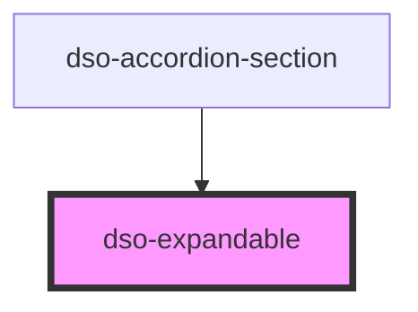

# `<dso-expandable>`

<!-- Auto Generated Below -->

## Properties

| Property          | Attribute          | Description                                                                                                                                     | Type                   | Default     |
| ----------------- | ------------------ | ----------------------------------------------------------------------------------------------------------------------------------------------- | ---------------------- | ----------- |
| `enableAnimation` | `enable-animation` | Set to `true` to show the content animated.                                                                                                     | `boolean`              | `false`     |
| `minimumHeight`   | `minimum-height`   | When enableAnimation is set to `true`, this property specifies the height of this element at which the animation will expand from / collapse to | `number \| undefined`  | `undefined` |
| `open`            | `open`             | Set to `true` to expand the content.                                                                                                            | `boolean \| undefined` | `undefined` |

## Events

| Event                         | Description             | Type                                         |
| ----------------------------- | ----------------------- | -------------------------------------------- |
| `dsoExpandableAnimationEnd`   | Fired after expanding.  | `CustomEvent<ExpandableAnimationEndEvent>`   |
| `dsoExpandableAnimationStart` | Fired before expanding. | `CustomEvent<ExpandableAnimationStartEvent>` |

## Dependencies

### Used by

- [dso-accordion-section](../accordion/components)

### Graph

---

_Built with [StencilJS](https://stenciljs.com/)_
