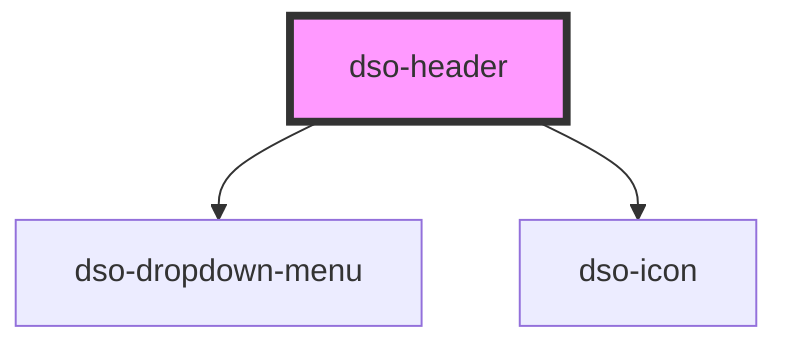

# `<dso-header>`

<!-- Auto Generated dso-toolkit -->

## Types

### HeaderEvent

```typescript
export type HeaderEvent = HeaderClickEvent | HeaderClickMenuItemEvent;
```

<!-- src/components/header/header.interfaces.ts::HeaderEvent -->

### HeaderMenuItem

```typescript
export interface HeaderMenuItem {
  label: string;
  url: string;
  active?: boolean;
}
```

<!-- src/components/header/header.interfaces.ts::HeaderMenuItem -->

<!-- Auto Generated Below -->

## Properties

| Property          | Attribute            | Description                                                                                                      | Type                                  | Default     |
| ----------------- | -------------------- | ---------------------------------------------------------------------------------------------------------------- | ------------------------------------- | ----------- |
| `authStatus`      | `auth-status`        | Used to show the login/logout option. 'none' renders nothing.                                                    | `"loggedIn" \| "loggedOut" \| "none"` | `"none"`    |
| `helpUrl`         | `help-url`           | The URL to open when the user activates "help". If no URL is specified, a button element is used instead.        | `string \| undefined`                 | `undefined` |
| `loginUrl`        | `login-url`          | When the `authStatus` is `loggedOut` a loginUrl can be provided. The login button will then render as an anchor. | `string \| undefined`                 | `undefined` |
| `logoutUrl`       | `logout-url`         | The URL to open when the user activates "logout". If no URL is specified, a button element is used instead.      | `string \| undefined`                 | `undefined` |
| `mainMenu`        | `main-menu`          | The main menu items.                                                                                             | `HeaderMenuItem[] \| undefined`       | `[]`        |
| `showHelp`        | `show-help`          | Show a help-button or link in the header                                                                         | `boolean \| undefined`                | `false`     |
| `useDropDownMenu` | `use-drop-down-menu` | Either have the dropdown menu appear automatically or always.                                                    | `"always" \| "auto"`                  | `"auto"`    |
| `userHomeActive`  | `user-home-active`   | Set this to true when the user is at "Mijn Omgevingsloket".                                                      | `boolean \| undefined`                | `undefined` |
| `userHomeUrl`     | `user-home-url`      | The URL to open when the user activates "Mijn Omgevingsloket".                                                   | `string \| undefined`                 | `undefined` |
| `userProfileName` | `user-profile-name`  | The name to show when the user is logged in.                                                                     | `string \| undefined`                 | `undefined` |
| `userProfileUrl`  | `user-profile-url`   | The URL to open when the user activates the profile url.                                                         | `string \| undefined`                 | `undefined` |

## Events

| Event            | Description                                                                                                                                       | Type                                                        |
| ---------------- | ------------------------------------------------------------------------------------------------------------------------------------------------- | ----------------------------------------------------------- |
| `dsoHeaderClick` | Emitted when something in the header is selected. `event.detail.type` indicates the functionality the user pressed. eg. `'login'` or `'menuItem'` | `CustomEvent<HeaderClickEvent \| HeaderClickMenuItemEvent>` |

## Dependencies

### Depends on

- [dso-dropdown-menu](../dropdown-menu)
- [dso-icon](../icon)

### Graph



---

_Built with [StencilJS](https://stenciljs.com/)_
