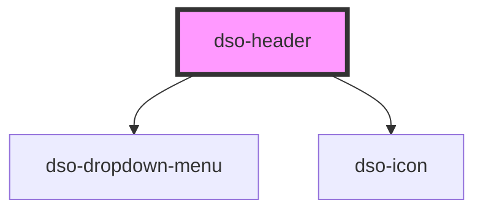

# dso-header

## Models

```typescript
interface HeaderMenuItem {
  label: string;
  url: string;
  active?: boolean;
}
```

<!-- Auto Generated Below -->


## Properties

| Property                | Attribute            | Description | Type                          | Default     |
| ----------------------- | -------------------- | ----------- | ----------------------------- | ----------- |
| `isLoggedIn`            | `is-logged-in`       |             | `boolean`                     | `false`     |
| `loginUrl`              | `login-url`          |             | `string \| undefined`         | `undefined` |
| `logoutUrl`             | `logout-url`         |             | `string \| undefined`         | `undefined` |
| `mainMenu` _(required)_ | --                   |             | `HeaderMenuItem[]`            | `undefined` |
| `useDropDownMenu`       | `use-drop-down-menu` |             | `"auto" \| "false" \| "true"` | `"auto"`    |
| `userHomeUrl`           | `user-home-url`      |             | `string \| undefined`         | `undefined` |
| `userProfileName`       | `user-profile-name`  |             | `string \| undefined`         | `undefined` |
| `userProfileUrl`        | `user-profile-url`   |             | `string \| undefined`         | `undefined` |


## Dependencies

### Depends on

- [dso-dropdown-menu](../dropdown-menu)
- [dso-icon](../icon)

### Graph


----------------------------------------------

*Built with [StencilJS](https://stenciljs.com/)*
