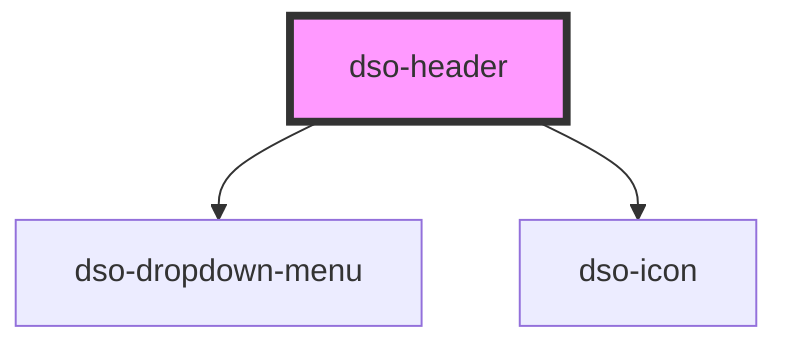

# dso-header

## Models

```typescript
interface HeaderMenuItem {
  label: string;
  url: string;
  active?: boolean;
}

interface HeaderMenuItemClickEvent {
  originalEvent: MouseEvent;
  menuItem: HeaderMenuItem;
}

interface HeaderMenuLogoutClick {
  originalEvent: MouseEvent;
}
```

<!-- Auto Generated Below -->


## Properties

| Property          | Attribute            | Description                                                                                                 | Type                                  | Default     |
| ----------------- | -------------------- | ----------------------------------------------------------------------------------------------------------- | ------------------------------------- | ----------- |
| `authStatus`      | `auth-status`        | Used to show the login/logout option. 'none' renders nothing.                                               | `"loggedIn" \| "loggedOut" \| "none"` | `"none"`    |
| `loginUrl`        | `login-url`          | When the `authStatus` is `loggedOut` a loginUrl can be provided, the login button will render as an anchor. | `string \| undefined`                 | `undefined` |
| `logoutUrl`       | `logout-url`         | The URL to open when the user activates "logout".                                                           | `string \| undefined`                 | `undefined` |
| `mainMenu`        | --                   | The main menu items.                                                                                        | `HeaderMenuItem[] \| undefined`       | `[]`        |
| `ribbon`          | `ribbon`             | The ribbon takes a short string and is shown as a label over the logo text.                                 | `string`                              | `"Beta"`    |
| `useDropDownMenu` | `use-drop-down-menu` | Either have the dropdown menu appear automatically or always.                                               | `"always" \| "auto"`                  | `"auto"`    |
| `userHomeActive`  | `user-home-active`   | Set this to true when the user is at "Mijn Omgevingsloket".                                                 | `boolean \| undefined`                | `undefined` |
| `userHomeUrl`     | `user-home-url`      | The URL to open when the user activates "Mijn Omgevingsloket".                                              | `string \| undefined`                 | `undefined` |
| `userProfileName` | `user-profile-name`  | The name to show when the user is logged in.                                                                | `string \| undefined`                 | `undefined` |
| `userProfileUrl`  | `user-profile-url`   | The URL to open when the user activates the profile url.                                                    | `string \| undefined`                 | `undefined` |


## Events

| Event            | Description                                                                                                                                        | Type                                                        |
| ---------------- | -------------------------------------------------------------------------------------------------------------------------------------------------- | ----------------------------------------------------------- |
| `dsoHeaderClick` | Emitted when something in the header is selected.  `event.detail.type` indicates the functionality the user pressed. eg. `'login'` or `'menuItem'` | `CustomEvent<HeaderClickEvent \| HeaderClickMenuItemEvent>` |


## Dependencies

### Depends on

- [dso-dropdown-menu](../dropdown-menu)
- [dso-icon](../icon)

### Graph


----------------------------------------------

*Built with [StencilJS](https://stenciljs.com/)*
