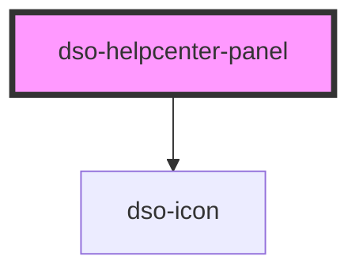

# `<dso-helpcenter-panel>`

<!-- Auto Generated Below -->

## Properties

| Property           | Attribute | Description | Type                  | Default        |
| ------------------ | --------- | ----------- | --------------------- | -------------- |
| `label`            | `label`   |             | `string \| undefined` | `"Hulp nodig"` |
| `url` _(required)_ | `url`     |             | `string`              | `undefined`    |

## Dependencies

### Depends on

- [dso-icon](../icon)

### Graph

----------------------------------------------

*Built with [StencilJS](https://stenciljs.com/)*
