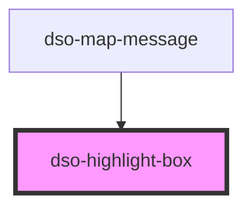

# `<dso-highlight-box>`

## Note
The default background color is `grey`. Other available variants are:
- Green
- Grey with border
- White with Dropshadow
- With Banner Image
- With border
- With icon
- Yellow

<!-- Auto Generated Below -->

## Properties

| Property     | Attribute     | Description                              | Type                   | Default     |
| ------------ | ------------- | ---------------------------------------- | ---------------------- | ----------- |
| `border`     | `border`      | For a bordered Highlight Box.            | `boolean \| undefined` | `undefined` |
| `dropShadow` | `drop-shadow` | For an Highlight Box with a drop shadow. | `boolean \| undefined` | `undefined` |
| `green`      | `green`       | For a green Highlight Box.               | `boolean \| undefined` | `undefined` |
| `step`       | `step`        | To create a step indicator.              | `number \| undefined`  | `undefined` |
| `white`      | `white`       | For a white Highlight Box.               | `boolean \| undefined` | `undefined` |
| `yellow`     | `yellow`      | For yellow Highlight Box.                | `boolean \| undefined` | `undefined` |

## Dependencies

### Used by

 - [dso-map-message](../map-message)

### Graph

----------------------------------------------

*Built with [StencilJS](https://stenciljs.com/)*
