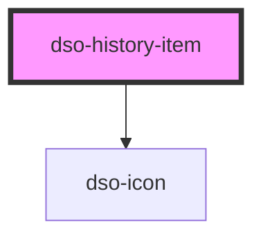

# `<dso-history-item>`

<!-- Auto Generated Below -->

## Properties

| Property            | Attribute | Description                                    | Type                                                                                   | Default     |
| ------------------- | --------- | ---------------------------------------------- | -------------------------------------------------------------------------------------- | ----------- |
| `href` _(required)_ | `href`    | The URL to which the History Item title links. | `string \| undefined`                                                                  | `undefined` |
| `type` _(required)_ | `type`    | The type of History Item                       | `"Besluit" \| "In Werking" \| "Ontwerp" \| "Tijdelijk Regelingdeel" \| "Waarschuwing"` | `undefined` |

## Events

| Event                 | Description                                     | Type                                 |
| --------------------- | ----------------------------------------------- | ------------------------------------ |
| `dsoHistoryItemClick` | Emitted when the History Item title is clicked. | `CustomEvent<HistoryItemClickEvent>` |

## Dependencies

### Depends on

- [dso-icon](../../../icon)

### Graph

----------------------------------------------

*Built with [StencilJS](https://stenciljs.com/)*
