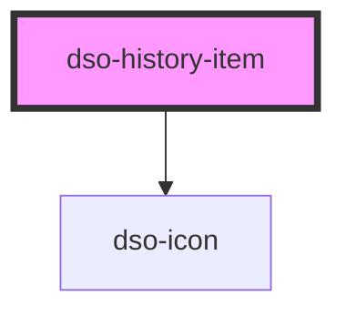

# `<dso-history-item>`

<!-- Auto Generated Below -->

## Properties

| Property            | Attribute | Description                                                                                             | Type                                                                                                                       | Default     |
| ------------------- | --------- | ------------------------------------------------------------------------------------------------------- | -------------------------------------------------------------------------------------------------------------------------- | ----------- |
| `href`              | `href`    | The optional URL to which the History Item title links. Needs to be provided when slot `title` is used. | `string \| undefined`                                                                                                      | `undefined` |
| `type` _(required)_ | `type`    | The type of History Item                                                                                | `"besluit" \| "in-werking" \| "ontwerp" \| "tijdelijk-regelingdeel" \| "tijdelijk-regelingdeel-besluit" \| "waarschuwing"` | `undefined` |

## Events

| Event      | Description                                     | Type                                 |
| ---------- | ----------------------------------------------- | ------------------------------------ |
| `dsoClick` | Emitted when the History Item title is clicked. | `CustomEvent<HistoryItemClickEvent>` |

## Slots

| Slot            | Description                                                                         |
| --------------- | ----------------------------------------------------------------------------------- |
| `"date"`        | The slot to place a string that holds a date in.                                    |
| `"explanation"` | An optional slot to place explanation in.                                           |
| `"status"`      | The slot to place the status message in.                                            |
| `"title"`       | An optional slot to place the title in. When used, the property `href` must be set. |
| `"warning"`     | An optional slot to place a warning in.                                             |

## Dependencies

### Depends on

- [dso-icon](../icon)

### Graph

----------------------------------------------

*Built with [StencilJS](https://stenciljs.com/)*
