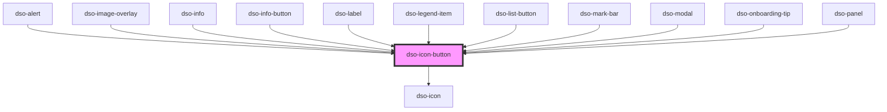

# `<dso-icon-button>`

<!-- Auto Generated Below -->

## Properties

| Property                       | Attribute           | Description                                                                   | Type                                     | Default       |
| ------------------------------ | ------------------- | ----------------------------------------------------------------------------- | ---------------------------------------- | ------------- |
| `accessibleLabel` _(required)_ | `accessible-label`  | The accessible label of the Icon Button which is shown on hover in a tooltip. | `string`                                 | `undefined`   |
| `disabled`                     | `disabled`          | To disable the Icon Button                                                    | `boolean`                                | `false`       |
| `icon` _(required)_            | `icon`              | The alias of the icon in the button.                                          | `string`                                 | `undefined`   |
| `tooltipPlacement`             | `tooltip-placement` | The placement of the tooltip on hover and focus of the Icon Button.           | `"bottom" \| "left" \| "right" \| "top"` | `"top"`       |
| `variant`                      | `variant`           | The variant of the Icon Button.                                               | `"map" \| "secondary" \| "tertiary"`     | `"secondary"` |

## Events

| Event                | Description                                   | Type                                |
| -------------------- | --------------------------------------------- | ----------------------------------- |
| `dsoIconButtonClick` | Emitted when the user clicks the Icon Button. | `CustomEvent<IconButtonClickEvent>` |

## Methods

### `setFocus() => Promise<void>`

Focuses the button.

#### Returns

Type: `Promise<void>`

## Dependencies

### Used by

 - [dso-alert](../alert)
 - [dso-image-overlay](../image-overlay)
 - [dso-info](../info)
 - [dso-info-button](../info-button)
 - [dso-label](../label)
 - [dso-legend-item](../legend-item)
 - [dso-list-button](../list-button)
 - [dso-mark-bar](../mark-bar)
 - [dso-modal](../modal)
 - [dso-onboarding-tip](../onboarding-tip)
 - [dso-panel](../panel)

### Depends on

- [dso-icon](../icon)

### Graph

----------------------------------------------

*Built with [StencilJS](https://stenciljs.com/)*
