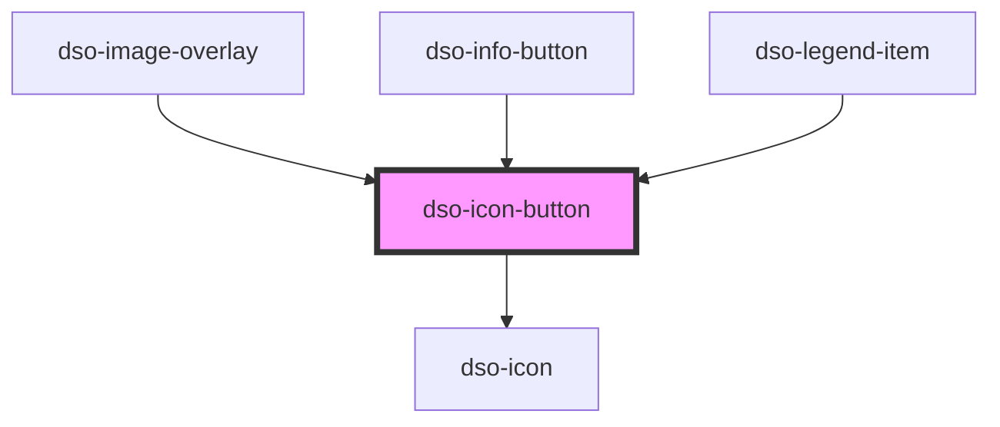

# dso-icon-button

<!-- Auto Generated Below -->

## Properties

| Property                       | Attribute           | Description                                                           | Type                                                                                                                                                                 | Default       |
| ------------------------------ | ------------------- | --------------------------------------------------------------------- | -------------------------------------------------------------------------------------------------------------------------------------------------------------------- | ------------- |
| `accessibleLabel` _(required)_ | `accessible-label`  | The accessible label of the button, also shown on hover in a tooltip. | `string`                                                                                                                                                             | `undefined`   |
| `icon` _(required)_            | `icon`              | The alias of the icon in the button.                                  | `string`                                                                                                                                                             | `undefined`   |
| `tooltipPlacement`             | `tooltip-placement` | The placement of the tooltip on hover of the icon button.             | `"bottom" \| "bottom-end" \| "bottom-start" \| "left" \| "left-end" \| "left-start" \| "right" \| "right-end" \| "right-start" \| "top" \| "top-end" \| "top-start"` | `"top"`       |
| `variant`                      | `variant`           | The variant of the icon button.                                       | `"map" \| "secondary" \| "tertiary"`                                                                                                                                 | `"secondary"` |

## Events

| Event                | Description                                | Type                                |
| -------------------- | ------------------------------------------ | ----------------------------------- |
| `dsoIconButtonClick` | Emitted when the user click the IconBtton. | `CustomEvent<IconButtonClickEvent>` |

## Methods

### `setFocus() => Promise<void>`

Focuses the button.

#### Returns

Type: `Promise<void>`

## Dependencies

### Used by

 - [dso-image-overlay](../image-overlay)
 - [dso-info-button](../info-button)
 - [dso-legend-item](../legend-item)

### Depends on

- [dso-icon](../icon)

### Graph

----------------------------------------------

*Built with [StencilJS](https://stenciljs.com/)*
