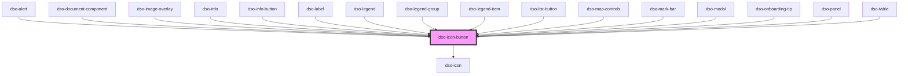

# `<dso-icon-button>`

<!-- Auto Generated Below -->

## Properties

| Property             | Attribute           | Description                                                         | Type                                              | Default       |
| -------------------- | ------------------- | ------------------------------------------------------------------- | ------------------------------------------------- | ------------- |
| `disabled`           | `disabled`          | To disable the Icon Button                                          | `boolean`                                         | `false`       |
| `icon` _(required)_  | `icon`              | The alias of the icon in the button.                                | `string \| undefined`                             | `undefined`   |
| `label` _(required)_ | `label`             | The label of the Icon Button which is shown on hover in a tooltip.  | `string \| undefined`                             | `undefined`   |
| `tooltipPlacement`   | `tooltip-placement` | The placement of the tooltip on hover and focus of the Icon Button. | `"bottom" \| "left" \| "right" \| "top"`          | `"top"`       |
| `variant`            | `variant`           | The variant of the Icon Button.                                     | `"map" \| "secondary" \| "tertiary" \| undefined` | `"secondary"` |

## Events

| Event      | Description                                   | Type                                |
| ---------- | --------------------------------------------- | ----------------------------------- |
| `dsoClick` | Emitted when the user clicks the Icon Button. | `CustomEvent<IconButtonClickEvent>` |

## Methods

### `setFocus() => Promise<void>`

Focuses the button.

#### Returns

Type: `Promise<void>`

## Dependencies

### Used by

 - [dso-alert](../alert)
 - [dso-document-component](../document-component)
 - [dso-image-overlay](../image-overlay)
 - [dso-info](../info)
 - [dso-info-button](../info-button)
 - [dso-label](../label)
 - [dso-legend](../legend)
 - [dso-legend-group](../legend/legend-group)
 - [dso-legend-item](../legend-item)
 - [dso-list-button](../list-button)
 - [dso-map-controls](../map-controls)
 - [dso-mark-bar](../mark-bar)
 - [dso-modal](../modal)
 - [dso-onboarding-tip](../onboarding-tip)
 - [dso-panel](../panel)
 - [dso-table](../table)

### Depends on

- [dso-icon](../icon)

### Graph

----------------------------------------------

*Built with [StencilJS](https://stenciljs.com/)*
