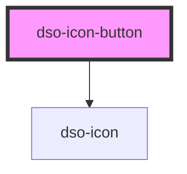

# dso-icon-button

<!-- Auto Generated Below -->

## Properties

| Property                       | Attribute           | Description                                                           | Type                                     | Default       |
| ------------------------------ | ------------------- | --------------------------------------------------------------------- | ---------------------------------------- | ------------- |
| `accessibleLabel` _(required)_ | `accessible-label`  | The accessible label of the button, also shown on hover in a tooltip. | `string`                                 | `undefined`   |
| `icon`                         | `icon`              | The name of the icon displayed in the button.                         | `string \| undefined`                    | `undefined`   |
| `tooltipPlacement`             | `tooltip-placement` | The placement of the tooltip on hover of the icon button.             | `"bottom" \| "left" \| "right" \| "top"` | `"top"`       |
| `variant`                      | `variant`           | The variants of the icon button.                                      | `"secondary" \| "tertiary" \| undefined` | `"secondary"` |

## Dependencies

### Depends on

- [dso-icon](../icon)

### Graph

```mermaid
graph TD;
  dso-icon-button --> dso-icon
  style dso-icon-button fill:#f9f,stroke:#333,stroke-width:4px
```

----------------------------------------------

*Built with [StencilJS](https://stenciljs.com/)*
