# `<dso-icon>`

<!-- Auto Generated Below -->

## Properties

| Property | Attribute | Description            | Type                  | Default     |
| -------- | --------- | ---------------------- | --------------------- | ----------- |
| `icon`   | `icon`    | The alias of the icon. | `string \| undefined` | `undefined` |

## Dependencies

### Used by

 - [dso-accordion-section](../accordion/components)
 - [dso-action-list-item](../action-list/components)
 - [dso-advanced-select](../advanced-select)
 - [dso-alert](../alert)
 - [dso-annotation-kaart](../annotation/annotation-kaart)
 - [dso-attachments-counter](../attachments-counter)
 - [dso-card](../card)
 - [dso-document-card](../document-card)
 - [dso-header](../header)
 - [dso-history-item](../history-item)
 - [dso-icon-button](../icon-button)
 - [dso-info-button](../info-button)
 - [dso-map-controls](../map-controls)
 - [dso-mark-bar](../mark-bar)
 - [dso-onboarding-tip](../onboarding-tip)
 - [dso-ozon-content](../ozon-content)
 - [dso-pagination](../pagination)
 - [dso-plekinfo-card](../plekinfo-card)
 - [dso-progress-indicator](../progress-indicator)
 - [dso-skiplink](../skiplink)
 - [dso-table](../table)
 - [dso-tijdreis-banner](../tijdreis-banner)
 - [dso-tree-view](../tree-view)

### Graph

```mermaid
graph TD;
  dso-accordion-section --> dso-icon
  dso-action-list-item --> dso-icon
  dso-advanced-select --> dso-icon
  dso-alert --> dso-icon
  dso-annotation-kaart --> dso-icon
  dso-attachments-counter --> dso-icon
  dso-card --> dso-icon
  dso-document-card --> dso-icon
  dso-header --> dso-icon
  dso-history-item --> dso-icon
  dso-icon-button --> dso-icon
  dso-info-button --> dso-icon
  dso-map-controls --> dso-icon
  dso-mark-bar --> dso-icon
  dso-onboarding-tip --> dso-icon
  dso-ozon-content --> dso-icon
  dso-pagination --> dso-icon
  dso-plekinfo-card --> dso-icon
  dso-progress-indicator --> dso-icon
  dso-skiplink --> dso-icon
  dso-table --> dso-icon
  dso-tijdreis-banner --> dso-icon
  dso-tree-view --> dso-icon
  style dso-icon fill:#f9f,stroke:#333,stroke-width:4px
```

----------------------------------------------

*Built with [StencilJS](https://stenciljs.com/)*
