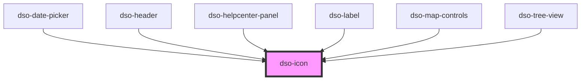

# `<dso-icon>`

<!-- Auto Generated Below -->

## Properties

| Property | Attribute | Description | Type                  | Default     |
| -------- | --------- | ----------- | --------------------- | ----------- |
| `icon`   | `icon`    |             | `string \| undefined` | `undefined` |

## Dependencies

### Used by

 - [dso-date-picker](../date-picker)
 - [dso-header](../header)
 - [dso-helpcenter-panel](../helpcenter-panel)
 - [dso-label](../label)
 - [dso-map-controls](../map-controls)
 - [dso-tree-view](../tree-view)

### Graph

----------------------------------------------

*Built with [StencilJS](https://stenciljs.com/)*
