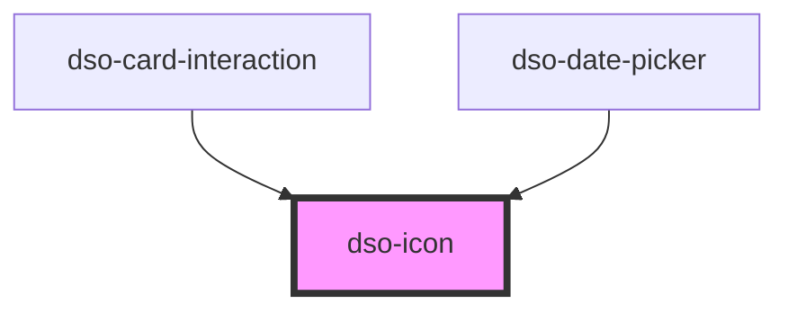

# dso-icon

<!-- Auto Generated Below -->

## Properties

| Property            | Attribute | Description | Type     | Default     |
| ------------------- | --------- | ----------- | -------- | ----------- |
| `icon` _(required)_ | `icon`    |             | `string` | `undefined` |

## Dependencies

### Used by

 - [dso-card-interaction](../card-interaction)
 - [dso-date-picker](../date-picker)

### Graph

----------------------------------------------

*Built with [StencilJS](https://stenciljs.com/)*
