# `<dso-icon>`

<!-- Auto Generated Below -->

## Properties

| Property | Attribute | Description | Type                  | Default     |
| -------- | --------- | ----------- | --------------------- | ----------- |
| `icon`   | `icon`    |             | `string \| undefined` | `undefined` |

## Dependencies

### Used by

 - [dso-accordion-section](../accordion/components)
 - [dso-alert](../alert)
 - [dso-attachments-counter](../attachments-counter)
 - [dso-date-picker](../date-picker)
 - [dso-header](../header)
 - [dso-helpcenter-panel](../helpcenter-panel)
 - [dso-image-overlay](../image-overlay)
 - [dso-info](../info)
 - [dso-info-button](../info-button)
 - [dso-label](../label)
 - [dso-list-button](../list-button)
 - [dso-map-controls](../map-controls)
 - [dso-modal](../modal)
 - [dso-pagination](../pagination)
 - [dso-table](../table)
 - [dso-tree-view](../tree-view)
 - [dso-viewer-grid](../viewer-grid)

### Graph

```mermaid
graph TD;
  dso-accordion-section --> dso-icon
  dso-alert --> dso-icon
  dso-attachments-counter --> dso-icon
  dso-date-picker --> dso-icon
  dso-header --> dso-icon
  dso-helpcenter-panel --> dso-icon
  dso-image-overlay --> dso-icon
  dso-info --> dso-icon
  dso-info-button --> dso-icon
  dso-label --> dso-icon
  dso-list-button --> dso-icon
  dso-map-controls --> dso-icon
  dso-modal --> dso-icon
  dso-pagination --> dso-icon
  dso-table --> dso-icon
  dso-tree-view --> dso-icon
  dso-viewer-grid --> dso-icon
  style dso-icon fill:#f9f,stroke:#333,stroke-width:4px
```

----------------------------------------------

*Built with [StencilJS](https://stenciljs.com/)*
