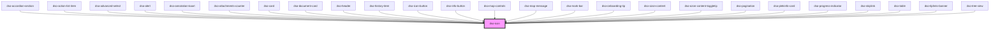

# `<dso-icon>`

<!-- Auto Generated Below -->

## Properties

| Property | Attribute | Description            | Type                                                                                                                                                                                                                                                                                                                                                                                                                                                                                                                                                                                                                                                                                                                                                                                                                                                                                                                                                                                                                                                                                                                                                                                                                                                                                                                                                                                                                                                                                                                                                                                                                                                                                                                                                                                                                                                                                                                                                                                                                                                  | Default     |
| -------- | --------- | ---------------------- | ----------------------------------------------------------------------------------------------------------------------------------------------------------------------------------------------------------------------------------------------------------------------------------------------------------------------------------------------------------------------------------------------------------------------------------------------------------------------------------------------------------------------------------------------------------------------------------------------------------------------------------------------------------------------------------------------------------------------------------------------------------------------------------------------------------------------------------------------------------------------------------------------------------------------------------------------------------------------------------------------------------------------------------------------------------------------------------------------------------------------------------------------------------------------------------------------------------------------------------------------------------------------------------------------------------------------------------------------------------------------------------------------------------------------------------------------------------------------------------------------------------------------------------------------------------------------------------------------------------------------------------------------------------------------------------------------------------------------------------------------------------------------------------------------------------------------------------------------------------------------------------------------------------------------------------------------------------------------------------------------------------------------------------------------------- | ----------- |
| `icon`   | `icon`    | The alias of the icon. | `"asterisk" \| "balloon-outline" \| "balloon-solid" \| "bars" \| "bell" \| "buildings" \| "calendar" \| "call" \| "caret-down" \| "caret-up" \| "check" \| "check-circle" \| "chevron-down" \| "chevron-down-down" \| "chevron-down-up" \| "chevron-left" \| "chevron-right" \| "chevron-up" \| "chevron-up-down" \| "chevron-up-up" \| "circle-notch" \| "clock-outline" \| "clock-solid" \| "copy-outline" \| "copy-solid" \| "cross" \| "crown" \| "cultural" \| "document" \| "document-pencil" \| "download" \| "energy" \| "environment" \| "exclamation" \| "external-link" \| "eye" \| "eye-slash" \| "filter" \| "forbidden" \| "hammer" \| "health" \| "help-outline" \| "help-solid" \| "home" \| "info-i" \| "info-outline" \| "info-solid" \| "infrastructure" \| "internet" \| "label" \| "land" \| "landscape" \| "layers" \| "light-bulb" \| "location" \| "location-orange" \| "location-search" \| "lock" \| "magnet" \| "mail-outline" \| "mail-solid" \| "map" \| "map-layers" \| "map-location" \| "marker" \| "measurement" \| "minus" \| "minus-circle-outline" \| "minus-circle-solid" \| "minus-square-outline" \| "minus-square-solid" \| "more-horizontal" \| "more-vertical" \| "municipality" \| "nature" \| "new-window" \| "paperclip" \| "parking" \| "pause" \| "pencil" \| "pin" \| "pin-outline" \| "play" \| "plus" \| "plus-circle-outline" \| "plus-circle-solid" \| "plus-square-outline" \| "plus-square-solid" \| "postcard" \| "print" \| "question" \| "redo" \| "scale" \| "search" \| "security" \| "settings" \| "share" \| "sitemap" \| "soil" \| "sort" \| "sort-ascending" \| "sort-descending" \| "sound" \| "spinner" \| "status-error" \| "status-forbidden" \| "status-info-outline" \| "status-info-solid" \| "status-success" \| "status-warning" \| "status-warning-red-outline" \| "status-warning-red-solid" \| "stop" \| "table-outline" \| "table-solid" \| "to-do-list" \| "trash" \| "undo" \| "user-outline" \| "user-solid" \| "users" \| "water" \| "weather" \| "wip" \| undefined` | `undefined` |

## Dependencies

### Used by

 - [dso-accordion-section](../accordion/components)
 - [dso-action-list-item](../action-list/components)
 - [dso-advanced-select](../advanced-select)
 - [dso-alert](../alert)
 - [dso-annotation-kaart](../annotation/annotation-kaart)
 - [dso-attachments-counter](../attachments-counter)
 - [dso-card](../card)
 - [dso-document-card](../document-card)
 - [dso-header](../header)
 - [dso-history-item](../history-item)
 - [dso-icon-button](../icon-button)
 - [dso-info-button](../info-button)
 - [dso-map-controls](../map-controls)
 - [dso-map-message](../map-message)
 - [dso-mark-bar](../mark-bar)
 - [dso-onboarding-tip](../onboarding-tip)
 - [dso-ozon-content](../ozon-content)
 - [dso-ozon-content-toggletip](../ozon-content/components/ozon-content-toggletip)
 - [dso-pagination](../pagination)
 - [dso-plekinfo-card](../plekinfo-card)
 - [dso-progress-indicator](../progress-indicator)
 - [dso-skiplink](../skiplink)
 - [dso-table](../table)
 - [dso-tijdreis-banner](../tijdreis-banner)
 - [dso-tree-view](../tree-view)

### Graph

```mermaid
graph TD;
  dso-accordion-section --> dso-icon
  dso-action-list-item --> dso-icon
  dso-advanced-select --> dso-icon
  dso-alert --> dso-icon
  dso-annotation-kaart --> dso-icon
  dso-attachments-counter --> dso-icon
  dso-card --> dso-icon
  dso-document-card --> dso-icon
  dso-header --> dso-icon
  dso-history-item --> dso-icon
  dso-icon-button --> dso-icon
  dso-info-button --> dso-icon
  dso-map-controls --> dso-icon
  dso-map-message --> dso-icon
  dso-mark-bar --> dso-icon
  dso-onboarding-tip --> dso-icon
  dso-ozon-content --> dso-icon
  dso-ozon-content-toggletip --> dso-icon
  dso-pagination --> dso-icon
  dso-plekinfo-card --> dso-icon
  dso-progress-indicator --> dso-icon
  dso-skiplink --> dso-icon
  dso-table --> dso-icon
  dso-tijdreis-banner --> dso-icon
  dso-tree-view --> dso-icon
  style dso-icon fill:#f9f,stroke:#333,stroke-width:4px
```

----------------------------------------------

*Built with [StencilJS](https://stenciljs.com/)*
