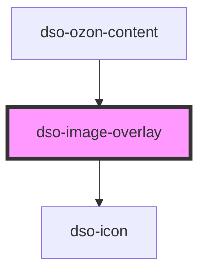

# `<dso-image-overlay>`

Dit component verwacht één (default) slotted `` element. Het component gebruikt alleen de attributen `src` en `alt` om de overlay te maken. Zonder deze attributen zal de overlay niet werken.

<!-- Auto Generated Below -->

## Properties

| Property      | Attribute     | Description      | Type                  | Default     |
| ------------- | ------------- | ---------------- | --------------------- | ----------- |
| `wijzigactie` | `wijzigactie` | The wijzigactie. | `string \| undefined` | `undefined` |

## Dependencies

### Used by

 - [dso-ozon-content](../ozon-content)

### Depends on

- [dso-icon](../icon)

### Graph

----------------------------------------------

*Built with [StencilJS](https://stenciljs.com/)*
