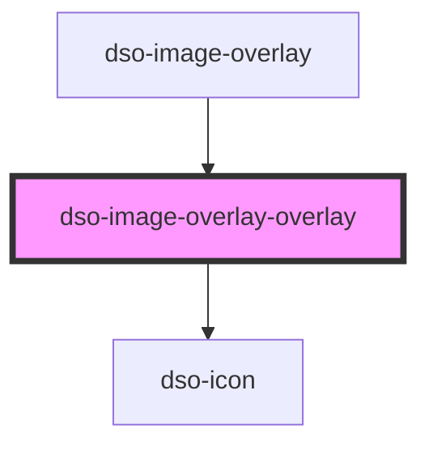

# `<dso-image-overlay>`

<!-- Auto Generated Below -->

## Properties

| Property | Attribute | Description | Type                  | Default     |
| -------- | --------- | ----------- | --------------------- | ----------- |
| `alt`    | `alt`     |             | `string \| undefined` | `undefined` |
| `src`    | `src`     |             | `string \| undefined` | `undefined` |

## Events

| Event   | Description | Type                     |
| ------- | ----------- | ------------------------ |
| `close` |             | `CustomEvent<undefined>` |

## Dependencies

### Used by

 - [dso-image-overlay](.)

### Depends on

- [dso-icon](../icon)

### Graph

----------------------------------------------

*Built with [StencilJS](https://stenciljs.com/)*
