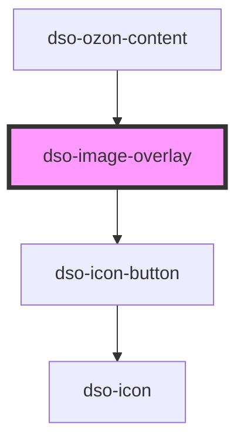

# `<dso-image-overlay>`

Dit component verwacht één (default) slotted `` element. Het component gebruikt alleen de attributen `src` en `alt` om de overlay te maken. Zonder deze attributen zal de overlay niet werken.

## Zoomgedrag

Het zoomgedrag van afbeeldingen wordt bepaald op basis van de gerenderde afmeting versus de intrinsieke afmeting van 
de afbeelding.

Als de intrinsieke afmeting gelijk of kleiner is aan de gerenderde afmeting, dan is de afbeelding **NIET** zoomable. 
Dit is de eerste en vierde situatie in onderstaande afbeelding.

Als de intrinsieke afmeting groter is dan de gerenderde afmeting, dan is de afbeelding **WEL** zoomable.
Dit is de tweede en derde situatie in onderstaande afbeelding.

Het kan voorkomen dat, afhankelijk van de beschikbare ruimte, kleine afbeeldingen uit `Ozon Content` zoomable zijn. 
Dit wordt veroorzaakt doordat de gerenderde afmeting kleiner is dan de intrinsieke afmeting. De gerenderde afmeting 
van een afbeelding uit `Ozon Content` wordt bepaald door de te volgen berekeningsmethode voor de afmeting van een 
afbeelding van de standaard die ten grondslag ligt aan `Ozon Content`. Daarnaast moet er rekening gehouden 
worden met beperkingen ten gevolge van fouten in de content.

Zie ook de documentatie van het component Ozon Content (onder de kop Afbeeldingen).

---

<!-- Auto Generated Below -->

## Properties

| Property      | Attribute     | Description      | Type                  | Default     |
| ------------- | ------------- | ---------------- | --------------------- | ----------- |
| `wijzigactie` | `wijzigactie` | The wijzigactie. | `string \| undefined` | `undefined` |

## Dependencies

### Used by

 - [dso-ozon-content](../ozon-content)

### Depends on

- [dso-icon-button](../icon-button)

### Graph

```mermaid
graph TD;
  dso-image-overlay --> dso-icon-button
  dso-icon-button --> dso-icon
  dso-ozon-content --> dso-image-overlay
  style dso-image-overlay fill:#f9f,stroke:#333,stroke-width:4px
```

----------------------------------------------

*Built with [StencilJS](https://stenciljs.com/)*
