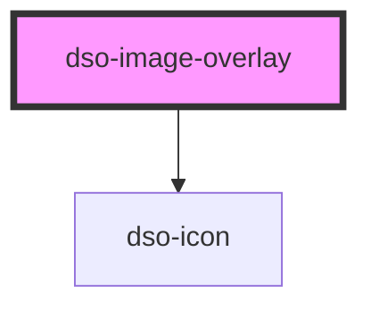

# `<dso-image-overlay>`

Dit component verwacht één (default) slotted `` element. Het component gebruikt alleen de attributen `src` en `alt` om de overlay te maken. Zonder deze attributen zal de overlay niet werken.

<!-- Auto Generated Below -->

## Properties

| Property     | Attribute    | Description | Type                  | Default     |
| ------------ | ------------ | ----------- | --------------------- | ----------- |
| `bijschrift` | `bijschrift` |             | `any`                 | `undefined` |
| `titel`      | `titel`      |             | `string \| undefined` | `undefined` |

## Dependencies

### Depends on

- [dso-icon](../icon)

### Graph

----------------------------------------------

*Built with [StencilJS](https://stenciljs.com/)*
