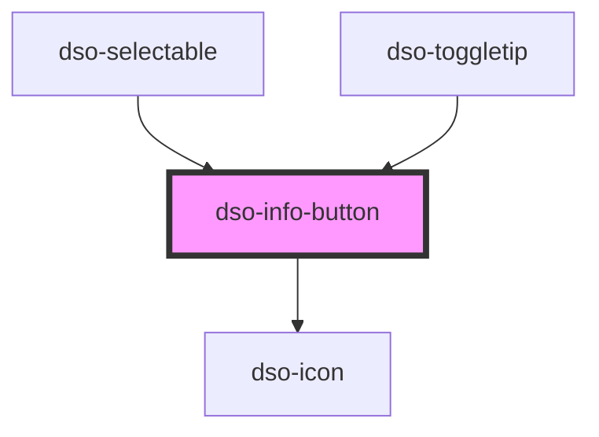

# `<dso-info-button>`

<!-- Auto Generated Below -->

## Properties

| Property    | Attribute   | Description | Type                   | Default                   |
| ----------- | ----------- | ----------- | ---------------------- | ------------------------- |
| `active`    | `active`    |             | `boolean \| undefined` | `undefined`               |
| `label`     | `label`     |             | `string`               | `'Toelichting bij optie'` |
| `secondary` | `secondary` |             | `boolean \| undefined` | `undefined`               |

## Events

| Event       | Description | Type                                 |
| ----------- | ----------- | ------------------------------------ |
| `dsoToggle` |             | `CustomEvent<InfoButtonToggleEvent>` |

## Methods

### `setFocus() => Promise<void>`

#### Returns

Type: `Promise<void>`

## Dependencies

### Used by

 - [dso-selectable](../selectable)
 - [dso-toggletip](../toggletip)

### Depends on

- [dso-icon](../icon)

### Graph

----------------------------------------------

*Built with [StencilJS](https://stenciljs.com/)*
