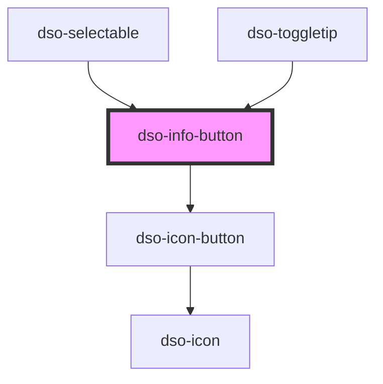

# `<dso-info-button>`

<!-- Auto Generated Below -->

## Properties

| Property    | Attribute   | Description                       | Type                   | Default                   |
| ----------- | ----------- | --------------------------------- | ---------------------- | ------------------------- |
| `active`    | `active`    | Whether the InfoButton is active. | `boolean \| undefined` | `undefined`               |
| `label`     | `label`     | The label.                        | `string`               | `"Toelichting bij optie"` |
| `secondary` | `secondary` | For secondary Info Button.        | `boolean \| undefined` | `undefined`               |

## Events

| Event       | Description                                      | Type                                 |
| ----------- | ------------------------------------------------ | ------------------------------------ |
| `dsoToggle` | Emitted when the user activates the Info Button. | `CustomEvent<InfoButtonToggleEvent>` |

## Methods

### `setFocus() => Promise<void>`

To set focus to the toggle button.

#### Returns

Type: `Promise<void>`

## Dependencies

### Used by

 - [dso-selectable](../selectable)
 - [dso-toggletip](../toggletip)

### Depends on

- [dso-icon-button](../icon-button)

### Graph

----------------------------------------------

*Built with [StencilJS](https://stenciljs.com/)*
