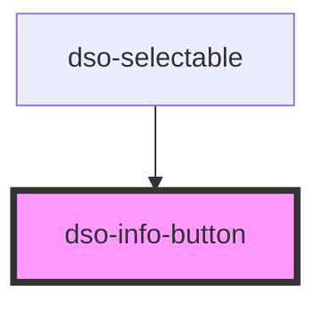

# `<dso-info-button>`

<!-- Auto Generated Below -->

## Properties

| Property | Attribute | Description | Type                   | Default                   |
| -------- | --------- | ----------- | ---------------------- | ------------------------- |
| `active` | `active`  |             | `boolean \| undefined` | `undefined`               |
| `label`  | `label`   |             | `string`               | `'Toelichting bij optie'` |

## Events

| Event    | Description | Type                                 |
| -------- | ----------- | ------------------------------------ |
| `toggle` |             | `CustomEvent<InfoButtonToggleEvent>` |

## Dependencies

### Used by

 - [dso-selectable](../selectable)

### Graph

----------------------------------------------

*Built with [StencilJS](https://stenciljs.com/)*
