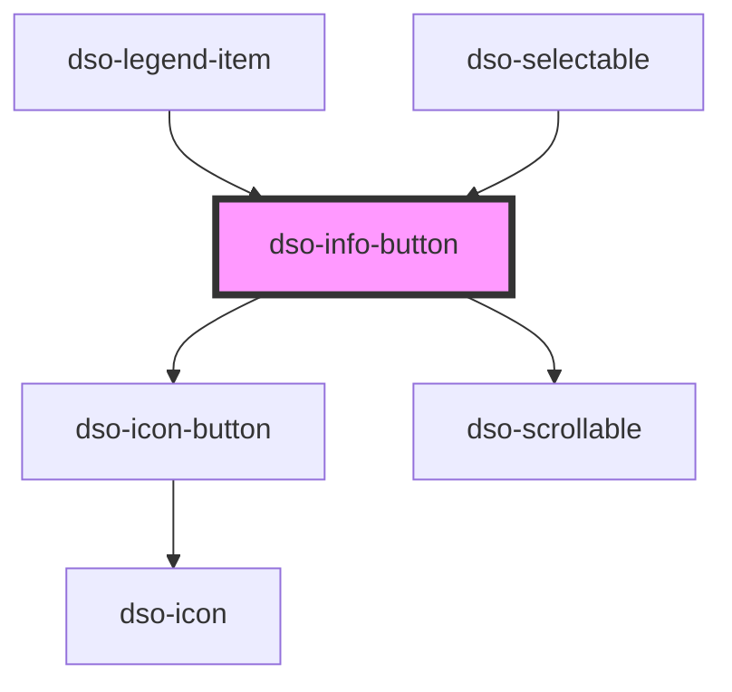

# `<dso-info-button>`

Het gedrag van de Info Button is afhankelijk van het gebruik van het toggletip-slot:

- Bij een klik emit de `Info Button` het `dsoToggle` event, zolang het `slot name="toggletip"` **niet** is gevuld.
- Indien het `slot name="toggletip"` **wél** is gevuld, verzorgt `Info Button` de Toggletip functionaliteit en 
  wordt er geen `dsoToggle` event meer ge-emit.

## Toegankelijkheid

De toggletip is volledig met het toetsenbord te bedienen:

- `Enter` of klik opent de toggletip
- `Escape` sluit de toggletip
- Focus buiten het component sluit de toggletip

Daarnaast wordt `aria-expanded` bijgewerkt, zodat screenreaders de actuele status aankondigen: bij een toggletip volgt
het de toggletip, anders de property `active` (bijvoorbeeld voor een externe `<dso-info>`, te koppelen via `controls`).
Zolang de toelichting open is, beschrijft deze de knop, zodat screenreaders de inhoud direct bij het openen voorlezen.

<!-- Auto Generated Below -->

## Properties

| Property             | Attribute             | Description                                                                                                                                                                                                                                                                                                   | Type                                     | Default                   |
| -------------------- | --------------------- | ------------------------------------------------------------------------------------------------------------------------------------------------------------------------------------------------------------------------------------------------------------------------------------------------------------- | ---------------------------------------- | ------------------------- |
| `active`             | `active`              | Whether the InfoButton is active.                                                                                                                                                                                                                                                                             | `boolean`                                | `false`                   |
| `controls`           | `controls`            | The id of the element (e.g. `<dso-info>`) that is expanded or collapsed by this Info Button. The element must be in the same document or shadow root as the Info Button. When a toggletip is present, this property is ignored. Without a toggletip, `aria-expanded` is only set when `controls` is provided. | `string \| undefined`                    | `undefined`               |
| `label`              | `label`               | The label.                                                                                                                                                                                                                                                                                                    | `string`                                 | `"Toelichting bij optie"` |
| `toggletipPlacement` | `toggletip-placement` | The placement of the Toggletip on click.                                                                                                                                                                                                                                                                      | `"bottom" \| "left" \| "right" \| "top"` | `"top"`                   |

## Events

| Event       | Description                                      | Type                                 |
| ----------- | ------------------------------------------------ | ------------------------------------ |
| `dsoToggle` | Emitted when the user activates the Info Button. | `CustomEvent<InfoButtonToggleEvent>` |

## Methods

### `setFocus() => Promise<void>`

To set focus to the toggle button.

#### Returns

Type: `Promise<void>`

## Slots

| Slot          | Description                                                    |
| ------------- | -------------------------------------------------------------- |
| `"toggletip"` | A slot for content displayed inside the info button toggletip. |

## Dependencies

### Used by

 - [dso-legend-item](../legend/legend-item)
 - [dso-selectable](../selectable)

### Depends on

- [dso-icon-button](../icon-button)
- [dso-scrollable](../scrollable)

### Graph

```mermaid
graph TD;
  dso-info-button --> dso-icon-button
  dso-info-button --> dso-scrollable
  dso-icon-button --> dso-icon
  dso-legend-item --> dso-info-button
  dso-selectable --> dso-info-button
  style dso-info-button fill:#f9f,stroke:#333,stroke-width:4px
```

----------------------------------------------

*Built with [StencilJS](https://stenciljs.com/)*
