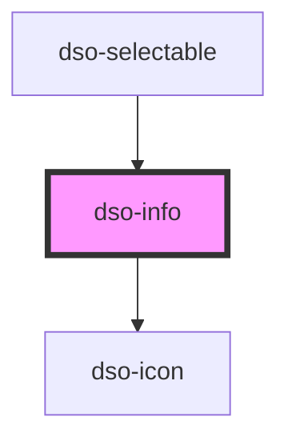

# `<dso-info>`

<!-- Auto Generated Below -->

## Properties

| Property | Attribute | Description                                                       | Type                   | Default     |
| -------- | --------- | ----------------------------------------------------------------- | ---------------------- | ----------- |
| `active` | `active`  | Whether the Info is active.                                       | `boolean \| undefined` | `undefined` |
| `fixed`  | `fixed`   | Set to true if the Info should not be toggled and always visible. | `boolean \| undefined` | `undefined` |

## Events

| Event      | Description                                       | Type                      |
| ---------- | ------------------------------------------------- | ------------------------- |
| `dsoClose` | Emitted when the user activates the close button. | `CustomEvent<MouseEvent>` |

## Dependencies

### Used by

- [dso-selectable](../selectable)

### Depends on

- [dso-icon](../icon)

### Graph

---

_Built with [StencilJS](https://stenciljs.com/)_
