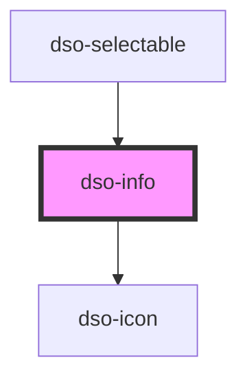

# `<dso-info>`

<!-- Auto Generated Below -->

## Properties

| Property | Attribute | Description | Type                   | Default     |
| -------- | --------- | ----------- | ---------------------- | ----------- |
| `active` | `active`  |             | `boolean \| undefined` | `undefined` |
| `fixed`  | `fixed`   |             | `boolean \| undefined` | `undefined` |

## Events

| Event      | Description | Type                      |
| ---------- | ----------- | ------------------------- |
| `dsoClose` |             | `CustomEvent<MouseEvent>` |

## Dependencies

### Used by

 - [dso-selectable](../selectable)

### Depends on

- [dso-icon](../icon)

### Graph

----------------------------------------------

*Built with [StencilJS](https://stenciljs.com/)*
