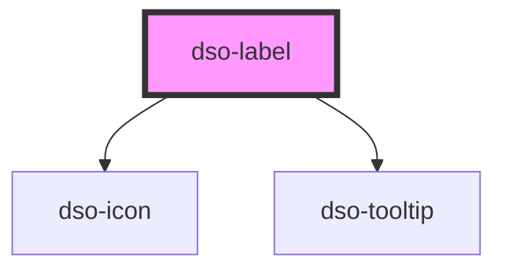

# `<dso-label>`

<!-- Auto Generated Below -->

## Properties

| Property    | Attribute   | Description | Type                                                                                 | Default     |
| ----------- | ----------- | ----------- | ------------------------------------------------------------------------------------ | ----------- |
| `compact`   | `compact`   |             | `boolean \| undefined`                                                               | `undefined` |
| `removable` | `removable` |             | `boolean \| undefined`                                                               | `undefined` |
| `status`    | `status`    |             | `"bright" \| "danger" \| "info" \| "primary" \| "success" \| "warning" \| undefined` | `undefined` |
| `truncate`  | `truncate`  |             | `boolean \| undefined`                                                               | `undefined` |

## Events

| Event            | Description | Type                      |
| ---------------- | ----------- | ------------------------- |
| `dsoRemoveClick` |             | `CustomEvent<MouseEvent>` |

## Dependencies

### Depends on

- [dso-icon](../icon)
- [dso-tooltip](../tooltip)

### Graph

----------------------------------------------

*Built with [StencilJS](https://stenciljs.com/)*
