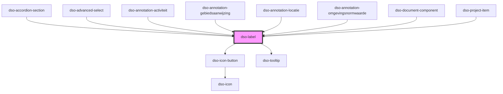

# `<dso-label>`

## Gedrag bij `[truncate]` en `[removable]`

In de content van het label wordt alleen tekst volledig ondersteund.

Wanneer het label getruncate wordt toont de tekst in de tooltip bij hoveren. De tekst die in `<dso-tooltip>` toont zal ook verborgen tekst tonen (uit bv. ``). De tekst die bij de `[removable]` knop wordt voorgelezen bevat ook verborgen tekst. In beiden gevallen wordt de tekst uitgelezen door middel van `HTMLElement.textContent` op `<dso-label>`.

<!-- Auto Generated Below -->

## Properties

| Property    | Attribute   | Description                                                                                     | Type                                                                                                                                           | Default     |
| ----------- | ----------- | ----------------------------------------------------------------------------------------------- | ---------------------------------------------------------------------------------------------------------------------------------------------- | ----------- |
| `compact`   | `compact`   | For compact Label                                                                               | `boolean \| undefined`                                                                                                                         | `undefined` |
| `removable` | `removable` | Shows a button that can be used to remove the Label.                                            | `boolean \| undefined`                                                                                                                         | `undefined` |
| `status`    | `status`    | The status of this Label.                                                                       | `"attention" \| "bright" \| "error" \| "filter" \| "info" \| "primary" \| "success" \| "toegevoegd" \| "verwijderd" \| "warning" \| undefined` | `undefined` |
| `truncate`  | `truncate`  | Whether the Label is allowed to truncate the contents if it does not fit the container element. | `boolean \| undefined`                                                                                                                         | `undefined` |

## Events

| Event            | Description                                        | Type                      |
| ---------------- | -------------------------------------------------- | ------------------------- |
| `dsoRemoveClick` | Emitted when the user activates the remove button. | `CustomEvent<MouseEvent>` |

## Dependencies

### Used by

 - [dso-accordion-section](../accordion/components)
 - [dso-advanced-select](../advanced-select)
 - [dso-annotation-activiteit](../annotation/annotation-activiteit)
 - [dso-annotation-gebiedsaanwijzing](../annotation/annotation-gebiedsaanwijzing)
 - [dso-annotation-locatie](../annotation/annotation-locatie)
 - [dso-annotation-omgevingsnormwaarde](../annotation/annotation-omgevingsnormwaarde)
 - [dso-document-component](../document-component)
 - [dso-project-item](../project-item)

### Depends on

- [dso-icon-button](../icon-button)
- [dso-tooltip](../tooltip)

### Graph

----------------------------------------------

*Built with [StencilJS](https://stenciljs.com/)*
