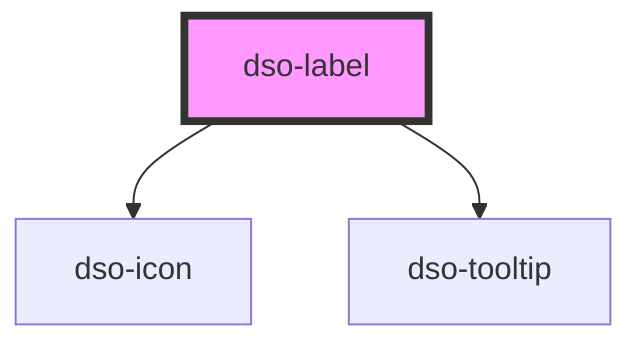

# `<dso-label>`

## Gedrag bij `[truncate]` en `[removable]`
In de content van het label wordt alleen tekst volledig ondersteund.

Wanneer het label getruncate wordt toont de tekst in de tooltip bij hoveren. De tekst die in `<dso-tooltip>` toont zal ook verborgen tekst tonen (uit bv. ``). De tekst die bij de `[removable]` knop wordt voorgelezen bevat ook verborgen tekst. In beiden gevallen wordt de tekst uitgelezen door middel van `HTMLElement.textContent` op `<dso-label>`.

<!-- Auto Generated Below -->

## Properties

| Property    | Attribute   | Description | Type                                                                                                           | Default     |
| ----------- | ----------- | ----------- | -------------------------------------------------------------------------------------------------------------- | ----------- |
| `compact`   | `compact`   |             | `boolean \| undefined`                                                                                         | `undefined` |
| `removable` | `removable` |             | `boolean \| undefined`                                                                                         | `undefined` |
| `status`    | `status`    |             | `"attention" \| "bright" \| "danger" \| "error" \| "info" \| "primary" \| "success" \| "warning" \| undefined` | `undefined` |
| `truncate`  | `truncate`  |             | `boolean \| undefined`                                                                                         | `undefined` |

## Events

| Event            | Description | Type                      |
| ---------------- | ----------- | ------------------------- |
| `dsoRemoveClick` |             | `CustomEvent<MouseEvent>` |

## Methods

### `syncLabelText() => Promise<void>`

**[Internal]** Synchronizes the text on the remove button and tooltip. You should never have to use this.

#### Returns

Type: `Promise<void>`

### `truncateLabel() => Promise<void>`

#### Returns

Type: `Promise<void>`

## Dependencies

### Depends on

- [dso-icon](../icon)
- [dso-tooltip](../tooltip)

### Graph

----------------------------------------------

*Built with [StencilJS](https://stenciljs.com/)*
