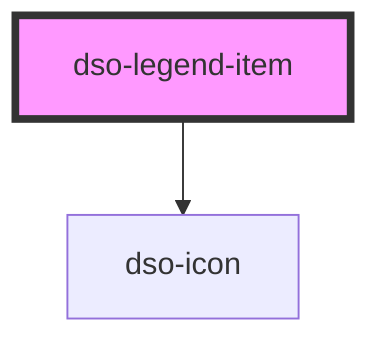

# `<dso-legend-item>`

<!-- Auto Generated Below -->

## Properties

| Property    | Attribute   | Description                                                   | Type                   | Default     |
| ----------- | ----------- | ------------------------------------------------------------- | ---------------------- | ----------- |
| `disabled`  | `disabled`  | To disable the Legend Item                                    | `boolean`              | `false`     |
| `removable` | `removable` | Shows a trash-can that, when clicked, emits `dsoRemoveClick`. | `boolean \| undefined` | `undefined` |

## Events

| Event            | Description                                        | Type                      |
| ---------------- | -------------------------------------------------- | ------------------------- |
| `dsoMouseEnter`  | Emitted when the mouse enters the Legend Item      | `CustomEvent<any>`        |
| `dsoMouseLeave`  | Emitted when the mouse leaves the Legend Item      | `CustomEvent<any>`        |
| `dsoRemoveClick` | Emitted when the user activates the remove button. | `CustomEvent<MouseEvent>` |

## Slots

| Slot           | Description                                                                                                                                                        |
| -------------- | ------------------------------------------------------------------------------------------------------------------------------------------------------------------ |
|                | The label for this legend item. Omit the label when a `dso-selectable` is placed in slot `selectable` is present. The label should than be on the `dso-selectable` |
| `"body"`       | The slot to place controls in (i.e. `dso-input-range` or multiple `dso-selectable`\`s)                                                                             |
| `"selectable"` | A dso-selectable for this legend item                                                                                                                              |
| `"symbol"`     | A span where the symbol is styled upon                                                                                                                             |

## Dependencies

### Depends on

- [dso-icon](../icon)

### Graph

----------------------------------------------

*Built with [StencilJS](https://stenciljs.com/)*
