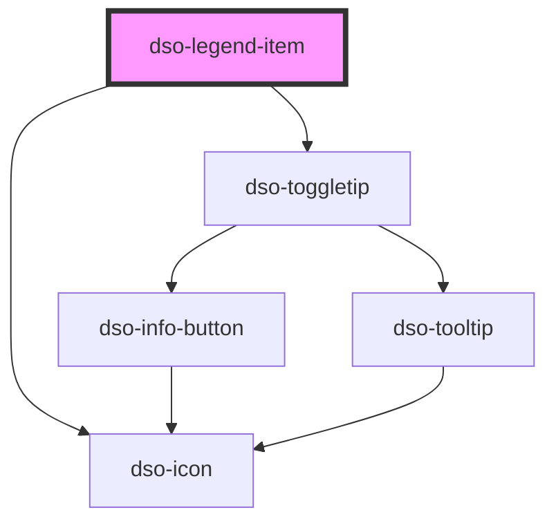

# `<dso-legend-item>`

<!-- Auto Generated Below -->

## Properties

| Property          | Attribute          | Description                                                             | Type                   | Default     |
| ----------------- | ------------------ | ----------------------------------------------------------------------- | ---------------------- | ----------- |
| `disabled`        | `disabled`         | To disable the Legend Item                                              | `boolean`              | `false`     |
| `disabledMessage` | `disabled-message` | Message to be shown behind a toggletip when the Legend Item is disabled | `string \| undefined`  | `undefined` |
| `removable`       | `removable`        | Shows a trash-can that, when clicked, emits `dsoRemoveClick`.           | `boolean \| undefined` | `undefined` |

## Events

| Event            | Description                                        | Type                                      |
| ---------------- | -------------------------------------------------- | ----------------------------------------- |
| `dsoMouseEnter`  | Emitted when the mouse enters the Legend Item      | `CustomEvent<any>`                        |
| `dsoMouseLeave`  | Emitted when the mouse leaves the Legend Item      | `CustomEvent<any>`                        |
| `dsoRemoveClick` | Emitted when the user activates the remove button. | `CustomEvent<LegendItemRemoveClickEvent>` |

## Slots

| Slot       | Description                                                                                                                                                                                                                                          |
| ---------- | ---------------------------------------------------------------------------------------------------------------------------------------------------------------------------------------------------------------------------------------------------- |
|            | Either the label for this legend item or a `dso-selectable` holding the label.                                                                                                                                                                       |
| `"body"`   | The slot to place controls in (i.e. `dso-input-range` or multiple `dso-selectable`\`s). If present, this will cause the appearance of an edit-button (three dots) to show the controls. Will not be displayed if property `disabled` is set to true. |
| `"symbol"` | A span where the symbol is styled upon                                                                                                                                                                                                               |

## Dependencies

### Depends on

- [dso-toggletip](../toggletip)
- [dso-icon](../icon)

### Graph

----------------------------------------------

*Built with [StencilJS](https://stenciljs.com/)*
