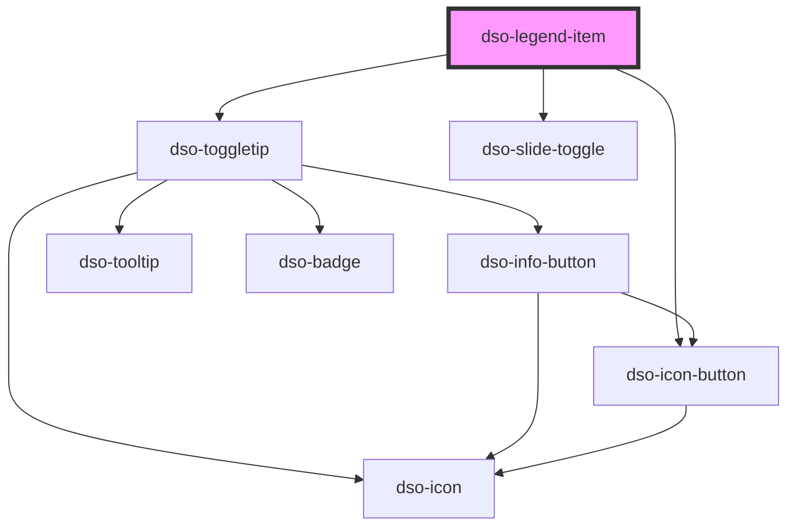

# `<dso-legend-item>`

<!-- Auto Generated Below -->

## Properties

| Property          | Attribute          | Description                                                             | Type                   | Default     |
| ----------------- | ------------------ | ----------------------------------------------------------------------- | ---------------------- | ----------- |
| `activatable`     | `activatable`      | Controls whether this Legend Item can be active or not                  | `boolean \| undefined` | `undefined` |
| `active`          | `active`           | Controls whether this Legend Item is active or not                      | `boolean \| undefined` | `undefined` |
| `disabled`        | `disabled`         | To disable the Legend Item                                              | `boolean`              | `false`     |
| `disabledMessage` | `disabled-message` | Message to be shown behind a toggletip when the Legend Item is disabled | `string \| undefined`  | `undefined` |

## Events

| Event             | Description                                            | Type                                       |
| ----------------- | ------------------------------------------------------ | ------------------------------------------ |
| `dsoActiveChange` | Emitted when user checks or unchecks the Slide Toggle. | `CustomEvent<LegendItemActiveChangeEvent>` |
| `dsoMouseEnter`   | Emitted when the mouse enters the Legend Item          | `CustomEvent<any>`                         |
| `dsoMouseLeave`   | Emitted when the mouse leaves the Legend Item          | `CustomEvent<any>`                         |

## Slots

| Slot                               | Description                                                                                                                                                                                                          |
| ---------------------------------- | -------------------------------------------------------------------------------------------------------------------------------------------------------------------------------------------------------------------- |
| `"The label for this Legend Item"` |                                                                                                                                                                                                                      |
| `"options"`                        | The slot to place controls in (i.e. `dso-input-range`). If present, this will cause the appearance of an edit-button (three dots) to show the controls. Will not be displayed if property `disabled` is set to true. |
| `"symbol"`                         | A span where the symbol is styled upon                                                                                                                                                                               |

## Dependencies

### Depends on

- [dso-toggletip](../toggletip)
- [dso-icon-button](../icon-button)
- [dso-slide-toggle](../slide-toggle)

### Graph

----------------------------------------------

*Built with [StencilJS](https://stenciljs.com/)*
