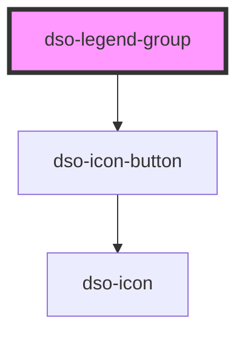

# dso-legend-group

<!-- Auto Generated Below -->

## Properties

| Property | Attribute | Description                                                                                                                              | Type                            | Default     |
| -------- | --------- | ---------------------------------------------------------------------------------------------------------------------------------------- | ------------------------------- | ----------- |
| `mode`   | `mode`    | Controls whether this Legend Group and its child Legend Items are in edit or view mode. When not set, no edit/view toggle icon is shown. | `"edit" \| "view" \| undefined` | `undefined` |

## Events

| Event                      | Description                                                 | Type                                      |
| -------------------------- | ----------------------------------------------------------- | ----------------------------------------- |
| `dsoLegendGroupModeChange` | Emitted when the user toggles the mode of the Legend Group. | `CustomEvent<LegendGroupModeChangeEvent>` |

## Slots

| Slot        | Description                                                                                    |
| ----------- | ---------------------------------------------------------------------------------------------- |
|             | The legend items for this group. Should contain `dso-legend-item` elements.                    |
| `"heading"` | The heading/label for this Legend Group. Should be targeted with `<h3 slot="heading">...</h3>` |

## Dependencies

### Depends on

- [dso-icon-button](../../icon-button)

### Graph

----------------------------------------------

*Built with [StencilJS](https://stenciljs.com/)*
