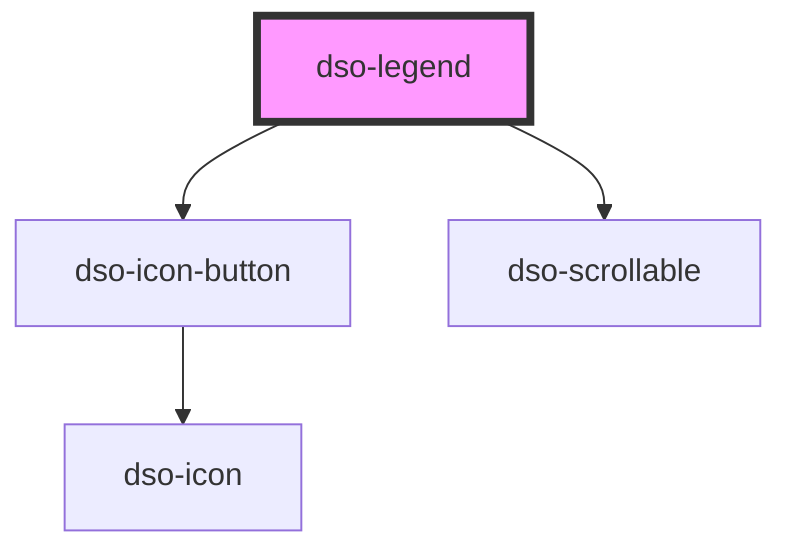

# `<dso-legend>`

 
<!-- Auto Generated Below -->

## Properties

| Property   | Attribute | Description                   | Type              | Default |
| ---------- | --------- | ----------------------------- | ----------------- | ------- |
| `tabItems` | --        | TabItems in the legend topbar | `LegendTabItem[]` | `[]`    |

## Events

| Event              | Description                              | Type                                    |
| ------------------ | ---------------------------------------- | --------------------------------------- |
| `dsoClose`         | Emitted when the user closes the Legend. | `CustomEvent<LegendCloseEvent>`         |
| `dsoContentSwitch` | Emitted when a tabItem is pressed.       | `CustomEvent<LegendContentSwitchEvent>` |

## Dependencies

### Depends on

- [dso-icon-button](../icon-button)
- [dso-scrollable](../scrollable)

### Graph

----------------------------------------------

*Built with [StencilJS](https://stenciljs.com/)*
