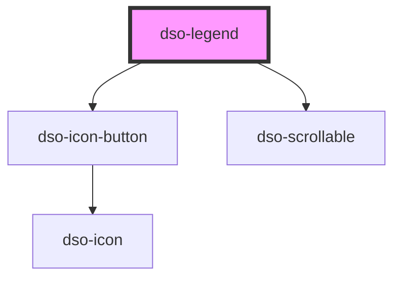

# `<dso-legend>`

 
<!-- Auto Generated Below -->

## Properties

| Property   | Attribute | Description                   | Type        | Default |
| ---------- | --------- | ----------------------------- | ----------- | ------- |
| `tabItems` | --        | TabItems in the legend topbar | `TabItem[]` | `[]`    |

## Events

| Event              | Description                                                                                                   | Type                                 |
| ------------------ | ------------------------------------------------------------------------------------------------------------- | ------------------------------------ |
| `dsoClose`         | Emitted when the user closes the Legend.                                                                      | `CustomEvent<dsoCloseEvent>`         |
| `dsoContentSwitch` | Emitted when a tabItems is pressed. The `tabItem` property contains the information of the tab being pressed. | `CustomEvent<dsoContentSwitchEvent>` |

## Dependencies

### Depends on

- [dso-icon-button](../icon-button)
- [dso-scrollable](../scrollable)

### Graph

----------------------------------------------

*Built with [StencilJS](https://stenciljs.com/)*
