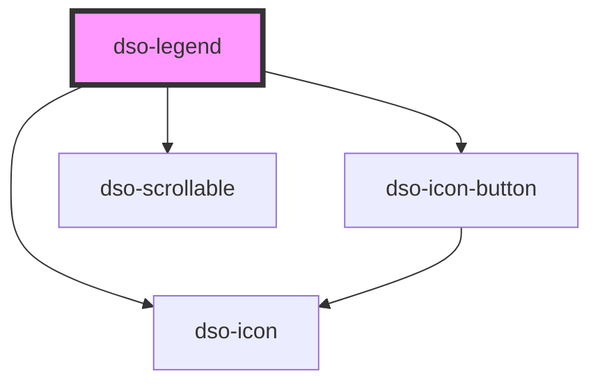

# `<dso-legend>`

 
<!-- Auto Generated Below -->

## Properties

| Property      | Attribute      | Description                | Type           | Default |
| ------------- | -------------- | -------------------------- | -------------- | ------- |
| `navbarItems` | `navbar-items` | Navbar items in the legend | `NavbarItem[]` | `[]`    |

## Events

| Event                      | Description                                                                                                            | Type                                      |
| -------------------------- | ---------------------------------------------------------------------------------------------------------------------- | ----------------------------------------- |
| `dsoClose`                 | Emitted when the user closes the Legend.                                                                               | `CustomEvent<LegendCloseEvent>`           |
| `dsoLegendNavbarItemClick` | Emitted when a navbar item is pressed. The `detail` property of the `CustomEvent` will contain the text of the anchor. | `CustomEvent<LegendNavbarItemClickEvent>` |

## Dependencies

### Depends on

- [dso-icon](../icon)
- [dso-icon-button](../icon-button)
- [dso-scrollable](../scrollable)

### Graph

```mermaid
graph TD;
  dso-legend --> dso-icon
  dso-legend --> dso-icon-button
  dso-legend --> dso-scrollable
  dso-icon-button --> dso-icon
  style dso-legend fill:#f9f,stroke:#333,stroke-width:4px
```

----------------------------------------------

*Built with [StencilJS](https://stenciljs.com/)*
