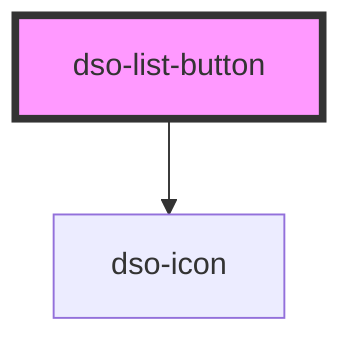

# dso-list-button

<!-- Auto Generated Below -->

## Properties

| Property   | Attribute  | Description                                                                                     | Type                            | Default     |
| ---------- | ---------- | ----------------------------------------------------------------------------------------------- | ------------------------------- | ----------- |
| `checked`  | `checked`  |                                                                                                 | `boolean`                       | `false`     |
| `count`    | `count`    | When defined the count can show on the list-button.                                             | `number \| undefined`           | `undefined` |
| `disabled` | `disabled` |                                                                                                 | `boolean`                       | `false`     |
| `label`    | `label`    |                                                                                                 | `string \| undefined`           | `undefined` |
| `manual`   | `manual`   | Allow user to directly input a value.  Set to `false` to force users to use plus/minus buttons. | `boolean`                       | `true`      |
| `max`      | `max`      |                                                                                                 | `number \| string \| undefined` | `undefined` |
| `min`      | `min`      |                                                                                                 | `number \| string \| undefined` | `undefined` |
| `sublabel` | `sublabel` |                                                                                                 | `string \| undefined`           | `undefined` |

## Events

| Event               | Description | Type                                   |
| ------------------- | ----------- | -------------------------------------- |
| `dsoCountChange`    |             | `CustomEvent<ListButtonChangeEvent>`   |
| `dsoSelectedChange` |             | `CustomEvent<ListButtonSelectedEvent>` |

## Dependencies

### Depends on

- [dso-icon](../icon)

### Graph

----------------------------------------------

*Built with [StencilJS](https://stenciljs.com/)*
