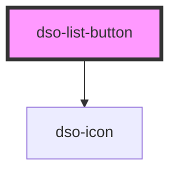

# dso-list-button

<!-- Auto Generated Below -->

## Properties

| Property         | Attribute          | Description                                                                            | Type                            | Default     |
| ---------------- | ------------------ | -------------------------------------------------------------------------------------- | ------------------------------- | ----------- |
| `checked`        | `checked`          |                                                                                        | `boolean \| undefined`          | `undefined` |
| `count`          | `count`            | When defined the count can show on the list-button.                                    | `number \| undefined`           | `undefined` |
| `hasInputNumber` | `has-input-number` | When set to true, the user can set the count. Changes are emitted with @dsoCountChange | `boolean \| undefined`          | `undefined` |
| `label`          | `label`            |                                                                                        | `string \| undefined`           | `undefined` |
| `max`            | `max`              |                                                                                        | `number \| string \| undefined` | `undefined` |
| `min`            | `min`              |                                                                                        | `number \| string \| undefined` | `undefined` |
| `subcontent`     | `subcontent`       |                                                                                        | `string \| undefined`           | `undefined` |
| `sublabel`       | `sublabel`         |                                                                                        | `string \| undefined`           | `undefined` |

## Events

| Event               | Description | Type                                   |
| ------------------- | ----------- | -------------------------------------- |
| `dsoCountChange`    |             | `CustomEvent<ListButtonChangeEvent>`   |
| `dsoSelectedChange` |             | `CustomEvent<ListButtonSelectedEvent>` |

## Dependencies

### Depends on

- [dso-icon](../icon)

### Graph

----------------------------------------------

*Built with [StencilJS](https://stenciljs.com/)*
