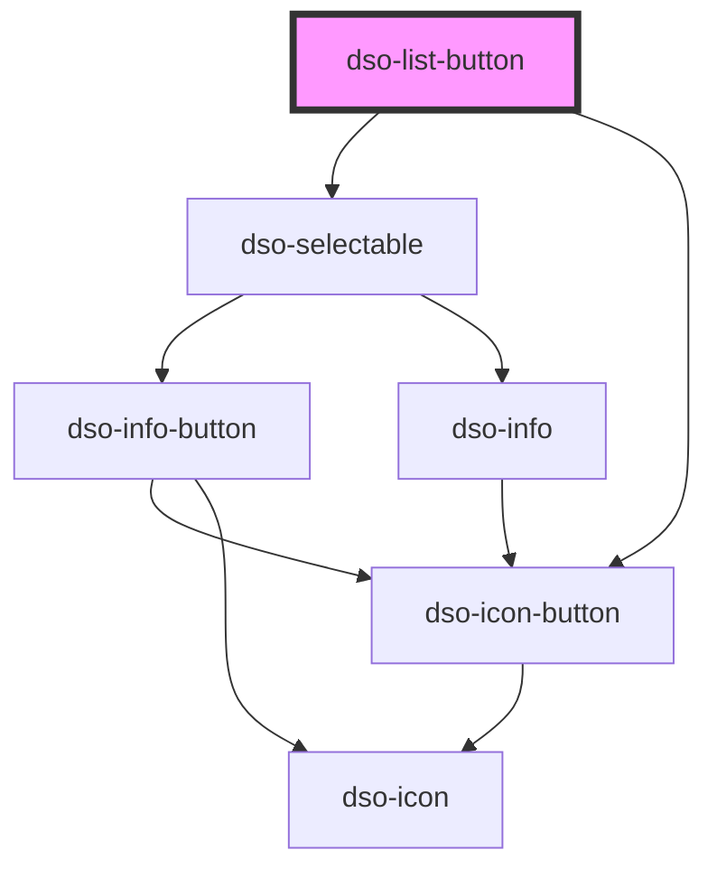

# `<dso-list-button>`

<!-- Auto Generated Below -->

## Properties

| Property           | Attribute           | Description                                            | Type                            | Default     |
| ------------------ | ------------------- | ------------------------------------------------------ | ------------------------------- | ----------- |
| `checked`          | `checked`           | Whether the List Button is checked.                    | `boolean`                       | `false`     |
| `count`            | `count`             | When defined the count can show on the List Button.    | `number \| undefined`           | `undefined` |
| `disabled`         | `disabled`          | Whether the List Button is disabled.                   | `boolean`                       | `false`     |
| `label`            | `label`             | The label of the List Button.                          | `string \| undefined`           | `undefined` |
| `max`              | `max`               | The maximum value.                                     | `number \| string \| undefined` | `undefined` |
| `min`              | `min`               | The minimum value.                                     | `number \| string \| undefined` | `undefined` |
| `subcontentPrefix` | `subcontent-prefix` | Prefix to subcontent for the purpose of screenreading. | `string \| undefined`           | `undefined` |
| `sublabel`         | `sublabel`          | The sublabel of the List Button.                       | `string \| undefined`           | `undefined` |

## Events

| Event               | Description                                                                                                        | Type                                   |
| ------------------- | ------------------------------------------------------------------------------------------------------------------ | -------------------------------------- |
| `dsoCountChange`    | Emitted when the user changes the count.                                                                           | `CustomEvent<ListButtonChangeEvent>`   |
| `dsoSelectedChange` | Emitted when the user activates the List Button itself.  Does not fire when the user activates the count controls. | `CustomEvent<ListButtonSelectedEvent>` |

## Dependencies

### Depends on

- [dso-selectable](../selectable)
- [dso-icon-button](../icon-button)

### Graph

----------------------------------------------

*Built with [StencilJS](https://stenciljs.com/)*
