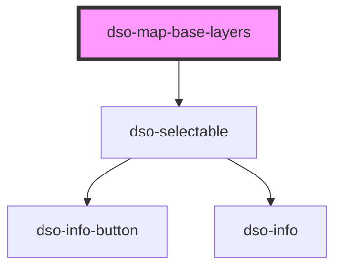

# dso-base-layers

<!-- Auto Generated Below -->

## Properties

| Property                  | Attribute | Description | Type                     | Default     |
| ------------------------- | --------- | ----------- | ------------------------ | ----------- |
| `baseLayers` _(required)_ | --        |             | `BaseLayer[]`            | `undefined` |
| `selectedBaseLayer`       | --        |             | `BaseLayer \| undefined` | `undefined` |

## Events

| Event             | Description | Type                     |
| ----------------- | ----------- | ------------------------ |
| `baseLayerChange` |             | `CustomEvent<BaseLayer>` |

## Dependencies

### Depends on

- [dso-selectable](../selectable)

### Graph

----------------------------------------------

*Built with [StencilJS](https://stenciljs.com/)*
