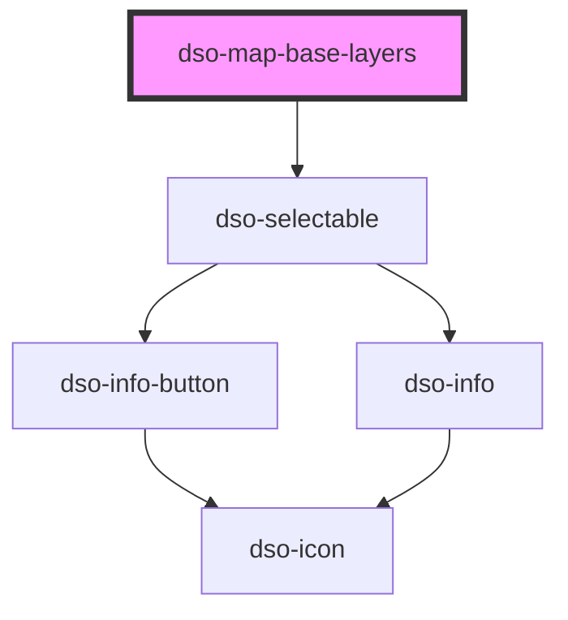

# dso-base-layers

Private component, do not use.

<!-- Auto Generated Below -->

## Properties

| Property                  | Attribute | Description | Type          | Default     |
| ------------------------- | --------- | ----------- | ------------- | ----------- |
| `baseLayers` _(required)_ | --        |             | `BaseLayer[]` | `undefined` |
| `group`                   | `group`   |             | `string`      | `uuidv4()`  |

## Events

| Event                | Description | Type                                |
| -------------------- | ----------- | ----------------------------------- |
| `dsoBaseLayerChange` |             | `CustomEvent<BaseLayerChangeEvent>` |

## Dependencies

### Depends on

- [dso-selectable](../selectable)

### Graph

----------------------------------------------

*Built with [StencilJS](https://stenciljs.com/)*
