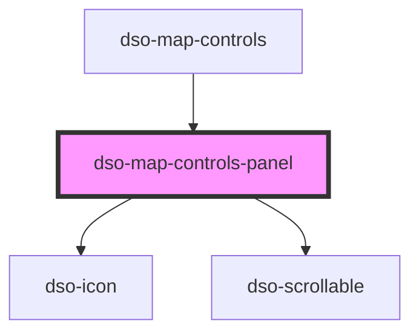

# dso-map-controls-panel

<!-- Auto Generated Below -->

## Properties

| Property     | Attribute     | Description                                                                                                           | Type                      | Default        |
| ------------ | ------------- | --------------------------------------------------------------------------------------------------------------------- | ------------------------- | -------------- |
| `mode`       | `mode`        | How the panel is presented.   * `sidebar`: Panel is presented as sidebar.  * `floating`: Panel is presented as modal. | `"floating" \| "sidebar"` | `"sidebar"`    |
| `open`       | `open`        | To show and hide the Map Controls Panel.                                                                              | `boolean`                 | `false`        |
| `panelTitle` | `panel-title` | Text shown in the header of the panel.                                                                                | `string`                  | `"Kaartlagen"` |

## Events

| Event      | Description                                                     | Type                                      |
| ---------- | --------------------------------------------------------------- | ----------------------------------------- |
| `dsoClose` | This event is emitted when the user activates the close button. | `CustomEvent<MapControlsPanelCloseEvent>` |

## Dependencies

### Used by

 - [dso-map-controls](../map-controls)

### Depends on

- [dso-icon](../icon)
- [dso-scrollable](../scrollable)

### Graph

----------------------------------------------

*Built with [StencilJS](https://stenciljs.com/)*
