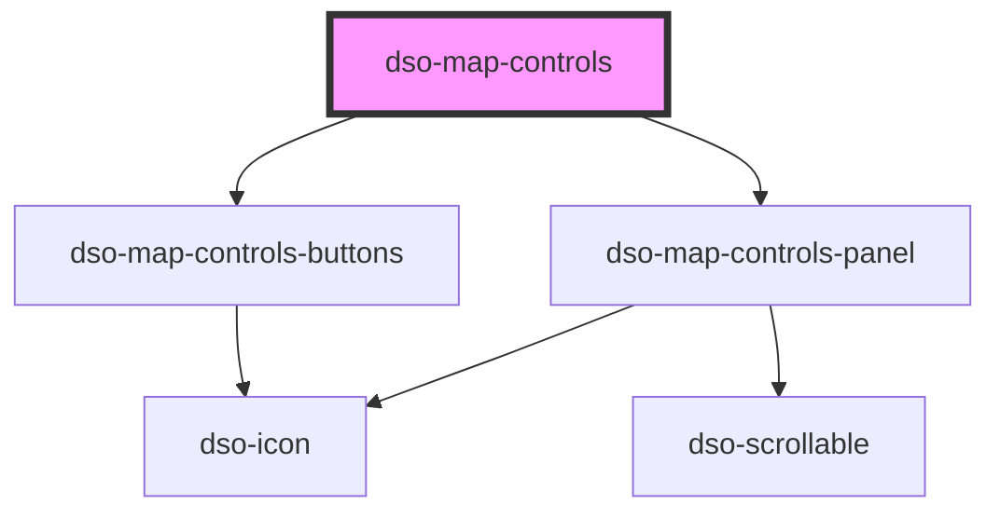

# dso-map-controls

<!-- Auto Generated Below -->

## Properties

| Property          | Attribute           | Description                                                                                                                              | Type                                   | Default        |
| ----------------- | ------------------- | ---------------------------------------------------------------------------------------------------------------------------------------- | -------------------------------------- | -------------- |
| `buttonLabel`     | `button-label`      | Text shown on the panel toggle button.                                                                                                   | `string`                               | `"Kaartlagen"` |
| `buttonLabelMode` | `button-label-mode` | When 'hidden', the button label will not be shown on large viewport.                                                                     | `"hidden" \| "responsive"`             | `"responsive"` |
| `disableZoom`     | `disable-zoom`      | To disable the zoom controls:  * `in`: Disable zoom in button. * `out`: Disable zoom out button. * `both`: Disable zoom in and zoom out. | `"both" \| "in" \| "out" \| undefined` | `undefined`    |
| `enableMapLayers` | `enable-map-layers` | To enable native map layers                                                                                                              | `boolean`                              | `true`         |
| `open`            | `open`              | To show and hide the Map Controls.                                                                                                       | `boolean`                              | `false`        |
| `panelTitle`      | `panel-title`       | Text shown in the header of the panel.                                                                                                   | `string`                               | `"Kaartlagen"` |

## Events

| Event        | Description                                                                                                                                                                                                                                                                                   | Type                                  |
| ------------ | --------------------------------------------------------------------------------------------------------------------------------------------------------------------------------------------------------------------------------------------------------------------------------------------- | ------------------------------------- |
| `dsoToggle`  | emits when the panel opens or closes.  - `event.detail.originalEvent` contains the original `MouseEvent / KeyboardEvent` when the panel is toggled by clicking the visibility button or the close button. - `event.detail.open` is true when the panel opens and false when the panel closes. | `CustomEvent<MapControlsToggleEvent>` |
| `dsoZoomIn`  | Emitted when the user activates the zoom in button.                                                                                                                                                                                                                                           | `CustomEvent<MouseEvent>`             |
| `dsoZoomOut` | Emitted when the user activates the zoom out button.                                                                                                                                                                                                                                          | `CustomEvent<MouseEvent>`             |

## Dependencies

### Depends on

- [dso-map-controls-buttons](../map-controls-buttons)
- [dso-map-controls-panel](../map-controls-panel)

### Graph

----------------------------------------------

*Built with [StencilJS](https://stenciljs.com/)*
