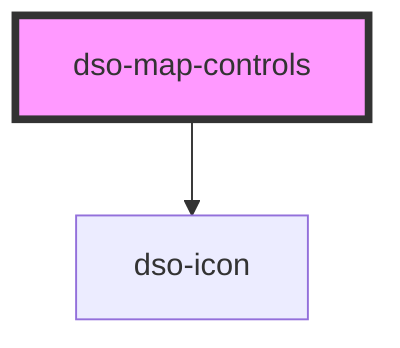

# dso-map-controls

<!-- Auto Generated Below -->

## Properties

| Property      | Attribute      | Description | Type                                   | Default     |
| ------------- | -------------- | ----------- | -------------------------------------- | ----------- |
| `disableZoom` | `disable-zoom` |             | `"both" \| "in" \| "out" \| undefined` | `undefined` |
| `open`        | `open`         |             | `boolean`                              | `false`     |

## Events

| Event        | Description | Type                      |
| ------------ | ----------- | ------------------------- |
| `dsoZoomIn`  |             | `CustomEvent<MouseEvent>` |
| `dsoZoomOut` |             | `CustomEvent<MouseEvent>` |

## Dependencies

### Depends on

- [dso-icon](../icon)

### Graph

----------------------------------------------

*Built with [StencilJS](https://stenciljs.com/)*
