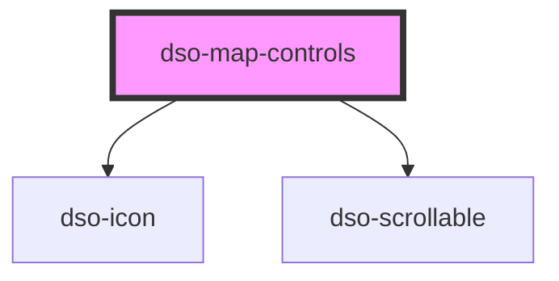

# dso-map-controls

<!-- Auto Generated Below -->

## Properties

| Property      | Attribute      | Description | Type                                   | Default     |
| ------------- | -------------- | ----------- | -------------------------------------- | ----------- |
| `disableZoom` | `disable-zoom` |             | `"both" \| "in" \| "out" \| undefined` | `undefined` |
| `open`        | `open`         |             | `boolean`                              | `false`     |

## Events

| Event        | Description                                                                                                                                                                                                                                                                                   | Type                                  |
| ------------ | --------------------------------------------------------------------------------------------------------------------------------------------------------------------------------------------------------------------------------------------------------------------------------------------- | ------------------------------------- |
| `dsoToggle`  | emits when the panel opens or closes.  - `event.detail.originalEvent` contains the original `MouseEvent / KeyboardEvent` when the panel is toggled by clicking the visibility button or the close button. - `event.detail.open` is true when the panel opens and false when the panel closes. | `CustomEvent<MapControlsToggleEvent>` |
| `dsoZoomIn`  |                                                                                                                                                                                                                                                                                               | `CustomEvent<MouseEvent>`             |
| `dsoZoomOut` |                                                                                                                                                                                                                                                                                               | `CustomEvent<MouseEvent>`             |

## Methods

### `toggleVisibility(e: MouseEvent | KeyboardEvent) => Promise<void>`

#### Returns

Type: `Promise<void>`

## Dependencies

### Depends on

- [dso-icon](../icon)
- [dso-scrollable](../scrollable)

### Graph

----------------------------------------------

*Built with [StencilJS](https://stenciljs.com/)*
