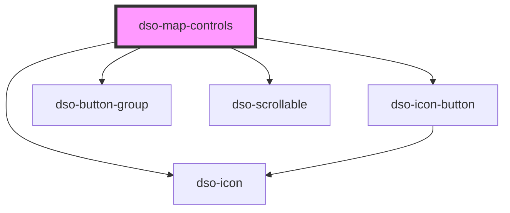

# `<dso-map-controls>`

<!-- Auto Generated Below -->

## Properties

| Property      | Attribute      | Description                                                                                                                              | Type                                   | Default     |
| ------------- | -------------- | ---------------------------------------------------------------------------------------------------------------------------------------- | -------------------------------------- | ----------- |
| `disableZoom` | `disable-zoom` | To disable the zoom controls:  * `in`: Disable zoom in button. * `out`: Disable zoom out button. * `both`: Disable zoom in and zoom out. | `"both" \| "in" \| "out" \| undefined` | `undefined` |
| `open`        | `open`         | To show and hide the Map Controls.                                                                                                       | `boolean`                              | `false`     |

## Events

| Event        | Description                                                                                                                                                                                                                                                                                   | Type                                  |
| ------------ | --------------------------------------------------------------------------------------------------------------------------------------------------------------------------------------------------------------------------------------------------------------------------------------------- | ------------------------------------- |
| `dsoToggle`  | emits when the panel opens or closes.  - `event.detail.originalEvent` contains the original `MouseEvent / KeyboardEvent` when the panel is toggled by clicking the visibility button or the close button. - `event.detail.open` is true when the panel opens and false when the panel closes. | `CustomEvent<MapControlsToggleEvent>` |
| `dsoZoomIn`  | Emitted when the user activates the zoom in button.                                                                                                                                                                                                                                           | `CustomEvent<MouseEvent>`             |
| `dsoZoomOut` | Emitted when the user activates the zoom out button.                                                                                                                                                                                                                                          | `CustomEvent<MouseEvent>`             |

## Methods

### `toggleVisibility(e: MouseEvent | KeyboardEvent) => Promise<void>`

Emitted when the visibility is toggled.

Can be used to recalculate map widths or reposition center when the Map Controls opens or closes.

#### Parameters

| Name | Type                          | Description |
| ---- | ----------------------------- | ----------- |
| `e`  | `MouseEvent \| KeyboardEvent` |             |

#### Returns

Type: `Promise<void>`

## Dependencies

### Depends on

- [dso-icon-button](../icon-button)
- [dso-icon](../icon)
- [dso-button-group](../button-group)
- [dso-scrollable](../scrollable)

### Graph

----------------------------------------------

*Built with [StencilJS](https://stenciljs.com/)*
