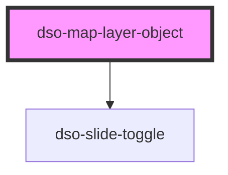

# `<dso-map-layer-object>`

<!-- Auto Generated Below -->

## Properties

| Property | Attribute | Description                                                            | Type                   | Default     |
| -------- | --------- | ---------------------------------------------------------------------- | ---------------------- | ----------- |
| `active` | `active`  | An optional boolean indicating whether the Map Layer Object is active. | `boolean \| undefined` | `undefined` |

## Events

| Event             | Description                                                      | Type                                           |
| ----------------- | ---------------------------------------------------------------- | ---------------------------------------------- |
| `dsoActiveChange` | Emitted when user activates or deactivates the Map Layer Object. | `CustomEvent<MapLayerObjectActiveChangeEvent>` |
| `dsoMouseEnter`   | Emitted when the mouse enters the Map Layer Object.              | `CustomEvent<any>`                             |
| `dsoMouseLeave`   | Emitted when the mouse leaves the Map Layer Object.              | `CustomEvent<any>`                             |

## Slots

| Slot       | Description                                                               |
| ---------- | ------------------------------------------------------------------------- |
|            | The label for this Map Layer Object                                       |
| `"symbol"` | An optional slot to place a symbol in, representing the Map Layer Object. |

## Dependencies

### Depends on

- [dso-slide-toggle](../../slide-toggle)

### Graph

----------------------------------------------

*Built with [StencilJS](https://stenciljs.com/)*
