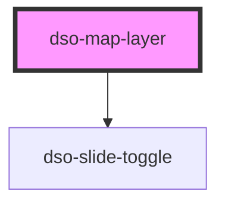

# `<dso-map-layer>`

<!-- Auto Generated Below -->

## Properties

| Property             | Attribute     | Description                                                                                                             | Type                   | Default     |
| -------------------- | ------------- | ----------------------------------------------------------------------------------------------------------------------- | ---------------------- | ----------- |
| `activatable`        | `activatable` | A boolean to indicate if the Map Layer is capable of being activated. When `true` a Slide Toggle displays on the right. | `boolean`              | `false`     |
| `active`             | `active`      | An optional boolean indicating whether the Map Layer is active.                                                         | `boolean \| undefined` | `undefined` |
| `label` _(required)_ | `label`       | The label of the Map Layer.                                                                                             | `string \| undefined`  | `undefined` |

## Events

| Event             | Description                                               | Type                                     |
| ----------------- | --------------------------------------------------------- | ---------------------------------------- |
| `dsoActiveChange` | Emitted when user activates or deactivates the Map Layer. | `CustomEvent<MapLayerActiveChangeEvent>` |

## Slots

| Slot | Description                                                                                      |
| ---- | ------------------------------------------------------------------------------------------------ |
|      | The dso-map-layer-object elements. These should be direct children of the dso-map-layer element. |

## Dependencies

### Depends on

- [dso-slide-toggle](../slide-toggle)

### Graph

----------------------------------------------

*Built with [StencilJS](https://stenciljs.com/)*
