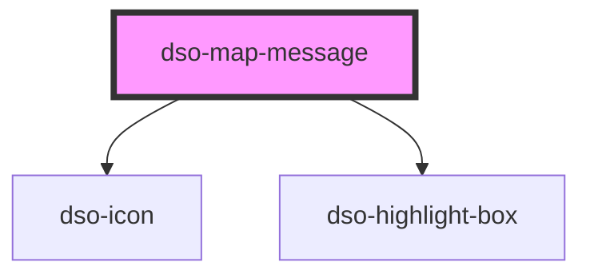

# `<dso-map-message>`

 
<!-- Auto Generated Below -->

## Properties

| Property       | Attribute | Description                                                                                                                 | Type                                    | Default         |
| -------------- | --------- | --------------------------------------------------------------------------------------------------------------------------- | --------------------------------------- | --------------- |
| `buttonLabels` | --        | The labels for the action buttons in the map message component.                                                             | `string[]`                              | `[]`            |
| `message`      | `message` | The message text to display in the map message component.                                                                   | `string`                                | `""`            |
| `variant`      | `variant` | Variant determines the icon and actions shown. Allowed values: "success", "error", "instruction". Default is "instruction". | `"error" \| "instruction" \| "success"` | `"instruction"` |

## Events

| Event            | Description                                                              | Type                                      |
| ---------------- | ------------------------------------------------------------------------ | ----------------------------------------- |
| `dsoActionClick` | Emitted when an action button is activated in the map message component. | `CustomEvent<MapMessageActionClickEvent>` |

## Dependencies

### Depends on

- [dso-icon](../icon)
- [dso-highlight-box](../highlight-box)

### Graph

----------------------------------------------

*Built with [StencilJS](https://stenciljs.com/)*
